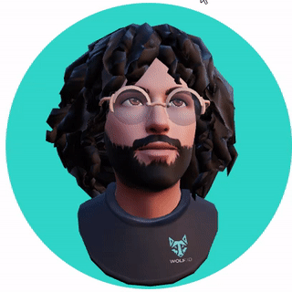
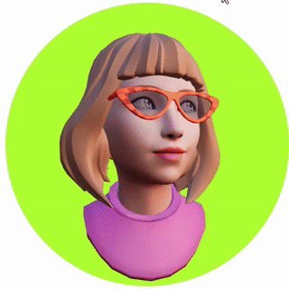
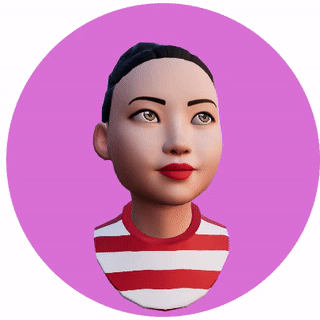

# Avatar View [](https://badge.fury.io/js/%40sarge%2Favatar-view)

3D Profile Avatar using Ready Player Me

Test it on CodeSandbox: https://codesandbox.io/s/avatar-view-wrn2u

---

 
 

## Test it Online
- Codesandbox: https://codesandbox.io/s/avatar-view-wrn2u

## Install

- Run in cli `npm i @sarge/avatar-view`

## Example

- First visit https://vr.readyplayer.me and create a half-body avatar.

- Copy the url of the .glb file of the avatar you created.

- Import `AvatarView` to your file.

- Add `<AvatarView url={url}/>` component yo your return content 

```jsx
// if you copy the code here dont forget to remove the three dots

import AvatarView from "@sarge/avatar-view";
...
const url = "https://d1a370nemizbjq.cloudfront.net/511ad04f-8b4e-4565-931d-94ecba87f3ac.glb";

export default function App() {
  return (
    <div>
        ...
        <AvatarView url={url}/>
        ...
    </div>
  );
}
```

## Parameters of AvatarView
- **url** (*string*): 

    Url of the Ready Player Me avatar to load. Must be half-body avatar url. This parameter is mandatory.

- **style** (*React.CSSProperties | undefined*): 

    Style of the avatar view canvas. Here you can change the border style, background color or image, width, height and other style options. This parameter is optional.

- **rotateAvatar** (*boolean | undefined*): 

    Enables use of orbit controls for the 3D scene, which helps you rotate the avatar via mouse drag. This parameter is optional.

- **eyeBlink** (*boolean | undefined*): 

    Enables eye blinking in random intervals. This parameter is optional.
    
- **headMovement** (*boolean | undefined*): 

    Enables head and eye follow of the cursor when avatar is facing the screen and cursor is moving on the canvas. When cursor is out of the canvas, avatar goes back to initial stance. This parameter is optional.
